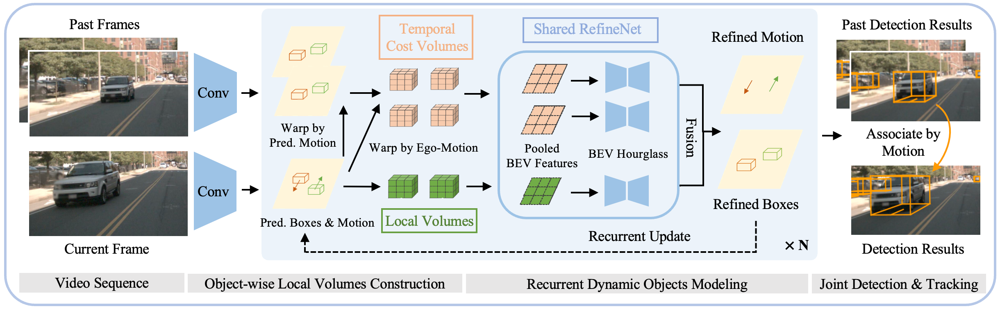

<h1>DORT: Modeling Dynamic Objects in Recurrent for Multi-Camera 3D Object Detection and Tracking.</h1>


This is the offical implementation of paper [DORT: Modeling Dynamic Objects in Recurrent for Multi-Camera 3D Object Detection and Tracking](https://arxiv.org/abs/2303.16628).

## Abstract

Recent multi-camera 3D object detectors usually leverage temporal information to construct multi-view stereo that alleviates the ill-posed depth estimation. However, they typically assume all the objects are static and directly aggregate features across frames. This work begins with a theoretical and empirical analysis to reveal that ignoring the motion of moving objects can result in serious localization bias. Therefore, we propose to model Dynamic Objects in RecurrenT (DORT) to tackle this problem. 
In contrast to previous global Bird-Eye-View (BEV) methods, DORT extracts object-wise local volumes for motion estimation that also alleviates the heavy computational burden. By iteratively refining the estimated object motion and location, the preceding features can be precisely aggregated to the current frame to mitigate the aforementioned adverse effects. The simple framework has two significant appealing properties. It is flexible and practical that can be plugged into most camera-based 3D object detectors. As there are predictions of object motion in the loop, it can easily track objects across frames according to their nearest center distances. Without bells and whistles, DORT outperforms all the previous methods on the nuScenes detection and tracking benchmarks with 62.5\% NDS and 57.6\% AMOTA, respectively.

<p align="center">
  
</p>


## News
- [2023-08] Our paper is accepted by CoRL 2023. &#x1F389;

## Main Results

We provide the main results on the nuScenes validation set with ResNet50 backbone.
<p align="center">

| config            | mAP      | NDS     | AMOTA     | AMOTP     |  checkpoint |
|:--------:|:----------:|:---------:|:--------:|:--------:|:--------:|
| [**DORT-R50-704x256**](./configs/dort/dort_bevdepth_resnet50_768x256.py)   | 37.9     | 52.1    | 42.4    | 1.264 | [**GDrive**]()  |
</p>


## Installation
1. Option 1: Following mmdet3d v1.0.0.rc3 to install mmdet3d and related packages (mmcv 1.4.2, mmcls 0.24.0, mmdetection, mmtracking)
2. Option 2: install mmcv 1.4.2 and then go to software/ to build each package.
3. python setup.py develop

## Dataset Preparation
1. Following mmdet3d to prepare the nuscenes dataset.
2. cd tools/ python create_bevdet4d_info.py # obtain the temporal information for multi-frame training.

## Training
```
bash tools/dist_train.sh configs/dort/dort_bevdepth_resnet50_768x256.py 8
```

## Inference
```
# detection
bash tools/dist_test.sh configs/dort/dort_bevdepth_resnet50_768x256.py 8 --load_from $you_checkpoint
# tracking
```

## Citation

```bibtex

@article{lian2023dort,
  title={DORT: Modeling Dynamic Objects in Recurrent for Multi-Camera 3D Object Detection and Tracking},
  author={Lian, Qing and Wang, Tai and Lin, Dahua and Pang, Jiangmiao},
  booktitle={CoRL},
  year={2023}
}
```
